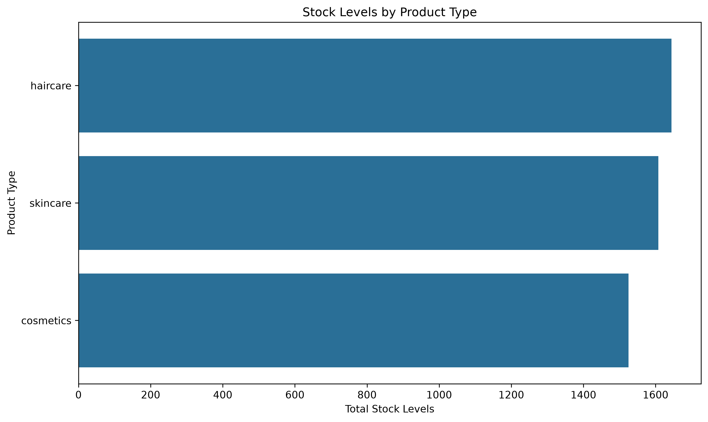
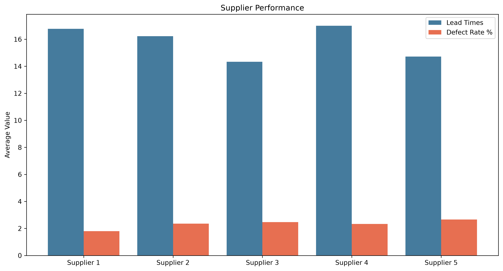
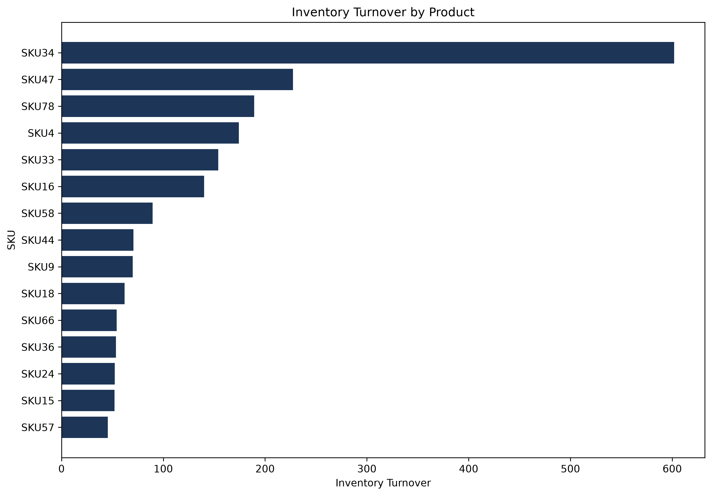
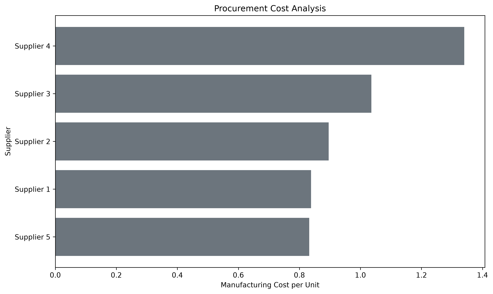
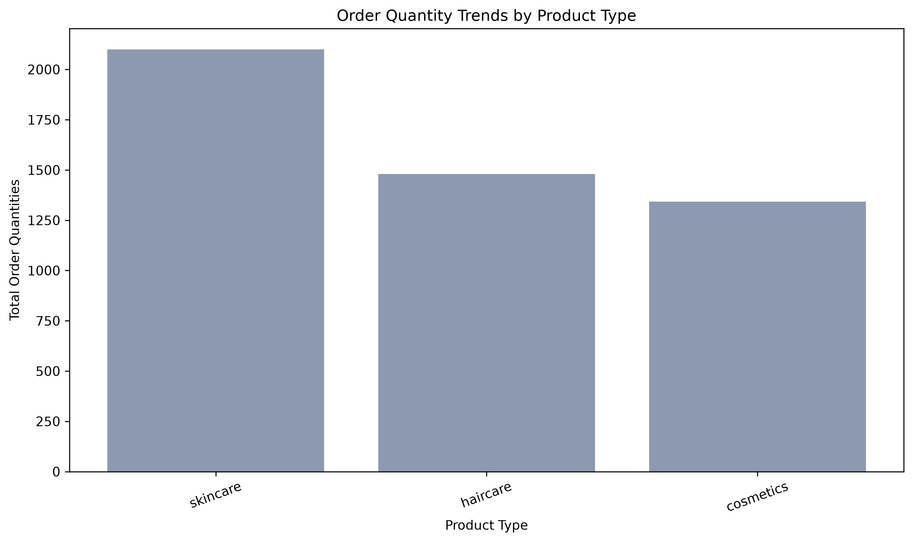
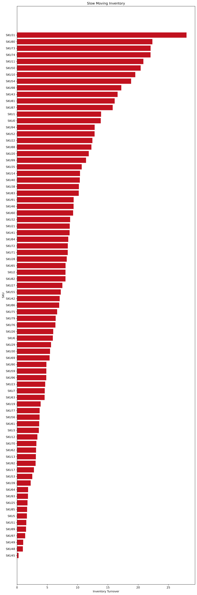

# Inventory Analysis

Inventory Analysis is a small Python project that turns supply chain data into practical operational insights. It loads the dataset in `data/supply_chain_data.csv`, calculates inventory and procurement metrics, generates visualizations, and compiles a PDF report for quick review.

## What the project does

- Inspects the dataset and uses the actual column names present in the CSV.
- Cleans missing values with simple numeric and categorical imputation.
- Adds calculated metrics for inventory turnover, procurement cost per unit, and defect rate percentage.
- Saves six charts to `output/`.
- Builds a multi-page PDF report from the saved charts.

## Repository structure

- `analysis.py` - loads the data, creates calculated columns, writes the charts, and prints a summary.
- `report.py` - assembles the PDF report from the generated images.
- `data/supply_chain_data.csv` - source dataset used by both scripts.
- `output/` - generated charts and the final PDF report.

## Dataset columns used

The scripts work with the actual CSV headers found in the dataset, including:

- `Product type`
- `SKU`
- `Stock levels`
- `Number of products sold`
- `Order quantities`
- `Supplier name`
- `Lead times`
- `Manufacturing costs`
- `Defect rates`

## Requirements

- Python 3.14 or compatible
- `pandas`
- `matplotlib`

## Generated outputs

Running the scripts creates these files in `output/`:

- `01_stock_levels_by_product_type.png`
- `02_supplier_performance.png`
- `03_inventory_turnover_by_product.png`
- `04_procurement_cost_analysis.png`
- `05_order_quantity_trends_by_product_type.png`
- `06_slow_moving_inventory.png`
- `Inventory_Report.pdf`

## Screenshots

### 1. Stock Levels by Product Type

This chart shows the total stock held for each product type so you can quickly compare inventory distribution across categories.

### 2. Supplier Performance

This grouped bar chart compares average lead times and defect rates for each supplier to highlight operational consistency.

### 3. Inventory Turnover by Product

This chart ranks the top 15 SKUs by inventory turnover so the fastest-moving products stand out immediately.

### 4. Procurement Cost Analysis

This chart shows manufacturing cost per unit by supplier to help identify the most and least cost-efficient sourcing options.

### 5. Order Quantity Trends by Product Type

This chart compares total order quantities across product types to reveal where demand is strongest.

### 6. Slow Moving Inventory

This chart highlights SKUs with below-average inventory turnover in red so slow-moving stock is easy to spot.

## Notes

- The analysis script prints a short summary to the console after chart generation.
- The report script expects the six chart images to already exist in `output/`.
- Generated files are ignored by Git so the repository stays focused on the source code and dataset.
